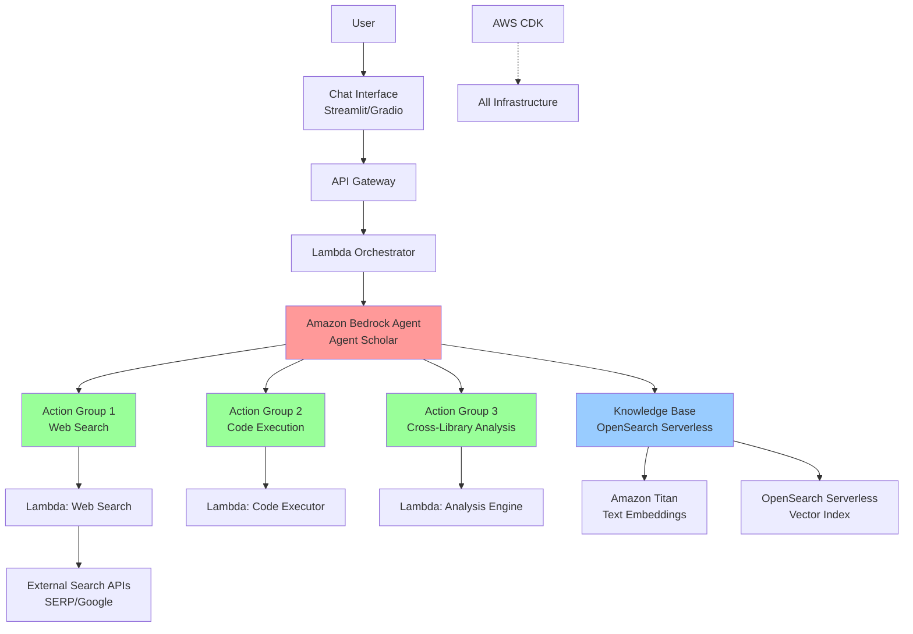
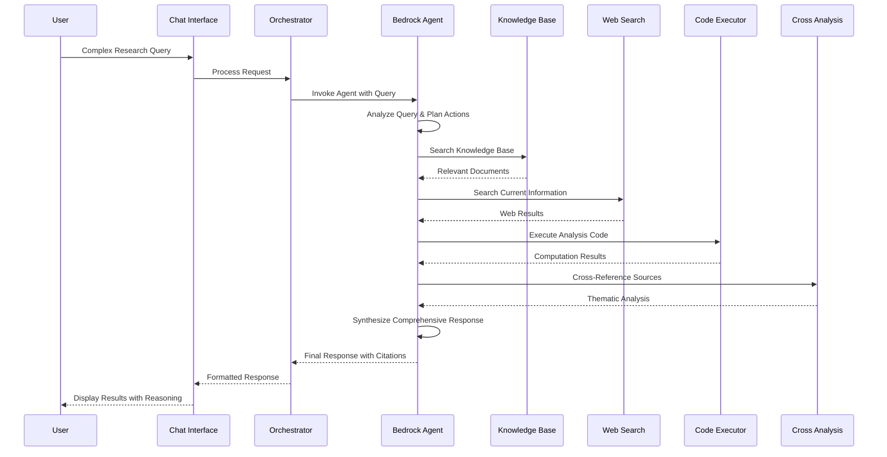

# Agent Scholar - Design Document

## Overview

Agent Scholar is a sophisticated AI research and analysis agent built on AWS serverless architecture. The system combines Amazon Bedrock Agent as the core reasoning engine with specialized action groups powered by Lambda functions, creating an autonomous agent capable of multi-modal research workflows. The design emphasizes scalability, reproducibility, and advanced AI capabilities that showcase the full potential of the AWS AI ecosystem.

The architecture follows a microservices pattern with clear separation of concerns: the Bedrock Agent handles reasoning and orchestration, OpenSearch Serverless provides semantic knowledge retrieval, and Lambda-based action groups enable specialized capabilities like web search, code execution, and cross-library analysis.

## Architecture

### High-Level System Architecture



### Core Components Flow



## Components and Interfaces

### 1. Amazon Bedrock Agent (Core Reasoning Engine)

**Purpose**: Central orchestrator that handles query understanding, task decomposition, and tool coordination.

**Configuration**:
- **Foundation Model**: Claude 3 Sonnet or Llama 3 from Bedrock model catalog
- **Agent Instructions**: Specialized prompts for research and analysis workflows
- **Action Groups**: Three specialized tool integrations
- **Knowledge Base**: Direct integration with OpenSearch vector store

**Key Capabilities**:
- Natural language query understanding and decomposition
- Autonomous tool selection and sequencing
- Context maintenance across multi-step workflows
- Response synthesis and citation management

**Interface**:
```python
# Agent invocation through Bedrock Runtime
bedrock_agent_runtime = boto3.client('bedrock-agent-runtime')

response = bedrock_agent_runtime.invoke_agent(
    agentId='agent-scholar-id',
    agentAliasId='TSTALIASID',
    sessionId=session_id,
    inputText=user_query
)
```

### 2. Knowledge Base (OpenSearch Serverless + Titan Embeddings)

**Purpose**: Semantic document storage and retrieval system for the curated library.

**Architecture**:
- **Embedding Model**: Amazon Titan Text Embeddings v1
- **Vector Store**: OpenSearch Serverless with vector indexing
- **Document Processing**: Chunking strategy with overlap for context preservation
- **Metadata Storage**: Document titles, authors, publication dates, and source information

**Document Processing Pipeline**:
```python
# Document ingestion workflow
def process_document(document_path):
    # 1. Extract text content
    text_content = extract_text(document_path)
    
    # 2. Chunk with overlap
    chunks = chunk_text(text_content, chunk_size=1000, overlap=200)
    
    # 3. Generate embeddings
    embeddings = titan_embeddings.embed_documents(chunks)
    
    # 4. Store in OpenSearch with metadata
    opensearch_client.index_documents(chunks, embeddings, metadata)
```

**Search Interface**:
- Vector similarity search with configurable threshold
- Hybrid search combining semantic and keyword matching
- Metadata filtering for source-specific queries
- Result ranking based on relevance and recency

### 3. Action Group 1: Web Search Integration

**Purpose**: Provides access to current information and recent developments to complement the static library.

**Implementation**:
- **Lambda Function**: `agent-scholar-web-search`
- **External APIs**: SERP API or Google Custom Search API
- **Rate Limiting**: Implemented to respect API quotas
- **Result Processing**: Automatic summarization and relevance scoring

**Lambda Function Structure**:
```python
def lambda_handler(event, context):
    query = event['inputText']
    parameters = event.get('parameters', {})
    
    # Execute web search
    search_results = search_api.search(
        query=query,
        num_results=parameters.get('max_results', 10),
        date_restrict=parameters.get('date_range', 'y1')  # Last year
    )
    
    # Process and rank results
    processed_results = process_search_results(search_results)
    
    return {
        'response': {
            'actionResponse': {
                'actionResponseBody': {
                    'TEXT': {
                        'body': format_search_response(processed_results)
                    }
                }
            }
        }
    }
```

**Integration with Agent**:
- Automatic invocation when agent detects need for current information
- Cross-referencing with knowledge base content
- Conflict detection and resolution between sources

### 4. Action Group 2: Code Execution Environment

**Purpose**: Enables computational validation, data visualization, and mathematical modeling of concepts from documents.

**Implementation**:
- **Lambda Function**: `agent-scholar-code-executor`
- **Execution Environment**: Sandboxed Python environment with scientific libraries
- **Security**: Restricted execution with timeout and resource limits
- **Output Handling**: Support for text, images, and data files

**Supported Libraries**:
```python
# Pre-installed packages in execution environment
ALLOWED_PACKAGES = [
    'numpy', 'pandas', 'matplotlib', 'seaborn', 'scipy',
    'scikit-learn', 'plotly', 'sympy', 'networkx'
]
```

**Execution Security**:
```python
def execute_code_safely(code_string, timeout=30):
    # Create restricted execution environment
    restricted_globals = create_safe_globals()
    
    # Set resource limits
    resource.setrlimit(resource.RLIMIT_CPU, (timeout, timeout))
    resource.setrlimit(resource.RLIMIT_AS, (512*1024*1024, 512*1024*1024))  # 512MB
    
    # Execute with monitoring
    try:
        exec(code_string, restricted_globals)
        return capture_outputs(restricted_globals)
    except Exception as e:
        return handle_execution_error(e)
```

### 5. Action Group 3: Cross-Library Analysis Engine

**Purpose**: Identifies thematic connections, contradictions, and synthesis opportunities across multiple documents.

**Implementation**:
- **Lambda Function**: `agent-scholar-analysis-engine`
- **Analysis Algorithms**: Semantic similarity, contradiction detection, author perspective analysis
- **Machine Learning**: Custom models for theme extraction and relationship mapping

**Analysis Capabilities**:
```python
class CrossLibraryAnalyzer:
    def analyze_themes(self, documents):
        # Extract key themes using NLP
        themes = self.theme_extractor.extract(documents)
        return self.cluster_themes(themes)
    
    def detect_contradictions(self, documents):
        # Identify conflicting statements
        statements = self.extract_claims(documents)
        return self.find_conflicts(statements)
    
    def author_perspective_analysis(self, documents):
        # Analyze different author viewpoints
        perspectives = self.extract_perspectives(documents)
        return self.compare_viewpoints(perspectives)
```

### 6. Chat Interface and User Experience

**Purpose**: Provides intuitive interaction with the agent and displays reasoning processes.

**Technology Stack**:
- **Frontend**: Streamlit or Gradio for rapid development
- **Backend Integration**: Direct connection to API Gateway
- **Real-time Updates**: WebSocket support for streaming responses
- **Visualization**: Integrated display of charts, graphs, and analysis results

**Interface Features**:
```python
# Streamlit interface structure
def main():
    st.title("Agent Scholar - AI Research Assistant")
    
    # Chat history
    display_chat_history()
    
    # Query input
    user_query = st.text_input("Ask your research question:")
    
    if user_query:
        # Show agent reasoning process
        with st.expander("Agent Reasoning Process"):
            display_agent_thinking(user_query)
        
        # Display comprehensive response
        response = invoke_agent_scholar(user_query)
        display_response_with_citations(response)
```

## Data Models

### Document Model
```python
@dataclass
class Document:
    id: str
    title: str
    authors: List[str]
    publication_date: datetime
    content: str
    chunks: List[DocumentChunk]
    metadata: Dict[str, Any]
    embedding_version: str

@dataclass
class DocumentChunk:
    chunk_id: str
    document_id: str
    content: str
    embedding: List[float]
    start_position: int
    end_position: int
```

### Query Processing Model
```python
@dataclass
class ResearchQuery:
    query_id: str
    user_id: str
    original_text: str
    processed_intent: QueryIntent
    required_tools: List[str]
    session_context: Dict[str, Any]

@dataclass
class QueryIntent:
    primary_intent: str  # search, analyze, compare, validate, synthesize
    entities: List[str]
    temporal_scope: Optional[str]
    complexity_level: int
```

### Response Model
```python
@dataclass
class AgentResponse:
    response_id: str
    query_id: str
    final_answer: str
    reasoning_steps: List[ReasoningStep]
    sources_used: List[Source]
    tools_invoked: List[ToolInvocation]
    confidence_score: float

@dataclass
class ReasoningStep:
    step_number: int
    action: str
    rationale: str
    result: str
```

## Error Handling

### Graceful Degradation Strategy

**Level 1 - Tool Failure**: If a specific action group fails, the agent continues with available tools and notes the limitation in the response.

**Level 2 - Knowledge Base Unavailable**: Falls back to web search and general knowledge from the foundation model.

**Level 3 - Agent Failure**: Direct LLM interaction with reduced capabilities but maintained functionality.

### Error Recovery Patterns
```python
class ErrorHandler:
    def handle_tool_failure(self, tool_name, error):
        # Log error and attempt alternative approach
        fallback_strategy = self.get_fallback_strategy(tool_name)
        return fallback_strategy.execute()
    
    def handle_timeout(self, operation):
        # Implement progressive timeout with partial results
        return self.return_partial_results_with_explanation()
```

## Testing Strategy

### Unit Testing
- **Lambda Functions**: Individual testing of each action group
- **Embedding Pipeline**: Validation of document processing and vector generation
- **Search Functionality**: Accuracy testing of semantic and hybrid search

### Integration Testing
- **End-to-End Workflows**: Complete query processing from input to response
- **Tool Coordination**: Multi-step scenarios requiring multiple action groups
- **Error Scenarios**: Failure handling and recovery testing

### Performance Testing
- **Load Testing**: Concurrent user simulation and response time measurement
- **Scalability Testing**: Auto-scaling behavior under varying loads
- **Resource Optimization**: Memory and compute efficiency analysis

### User Acceptance Testing
```python
# Example test scenarios
TEST_SCENARIOS = [
    {
        "query": "Compare the economic theories in Keynes' General Theory with modern MMT, and create a visualization of their key differences",
        "expected_tools": ["knowledge_base", "web_search", "code_execution", "cross_analysis"],
        "success_criteria": ["accurate_comparison", "valid_visualization", "proper_citations"]
    },
    {
        "query": "Find contradictions between the climate data in my library and recent IPCC reports",
        "expected_tools": ["knowledge_base", "web_search", "cross_analysis"],
        "success_criteria": ["contradiction_identification", "source_attribution", "temporal_analysis"]
    }
]
```

### Automated Testing Pipeline
- **CDK Testing**: Infrastructure validation and deployment testing
- **Regression Testing**: Ensuring updates don't break existing functionality
- **Security Testing**: Validation of sandboxed execution and data protection

This design provides a robust, scalable foundation for Agent Scholar that maximizes the technical execution score while delivering genuine research value. The architecture leverages AWS services optimally and demonstrates advanced AI agent capabilities that will impress hackathon judges.